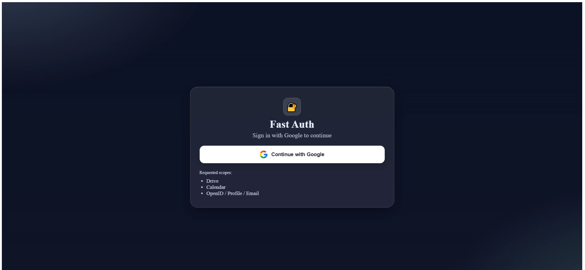
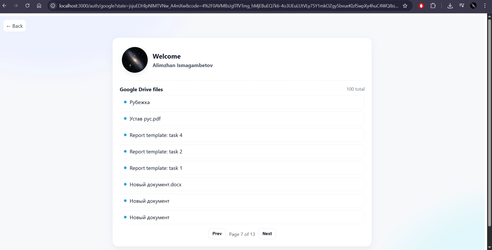

# FastAuth – Google OAuth2.0 Demo (FastAPI + Vue)
### Web app to obtain user information via Open ID Connect, and to obtain rights to resources in Google Calendar and Google Drive

Simple app to test OAuth2.0 with Google:
- builds the Google OAuth redirect URL
- exchanges code -> tokens
- fetches OpenID user info (sub, name, email, picture)
- lists files from Google Drive

### Welcome page
Redirects to "http: //localhost:8000 /auth/ google/url" 
- Redirects to Google for consent, then returns to the app to fetch your basic profile and list Drive files. No data is saved.

### Content page
<ins>Lists all files from the Drive </ins>

CSRF protection (`state`)
- Before redirecting to Google backend generates a cryptographically random `state`
  (`secrets.token_urlsafe(16)`) and store it server-side with a short TTL.
- Google returns the same `state` to the callback.
- If `state` is missing or invalid -> 400. This prevents CSRF and replay.

